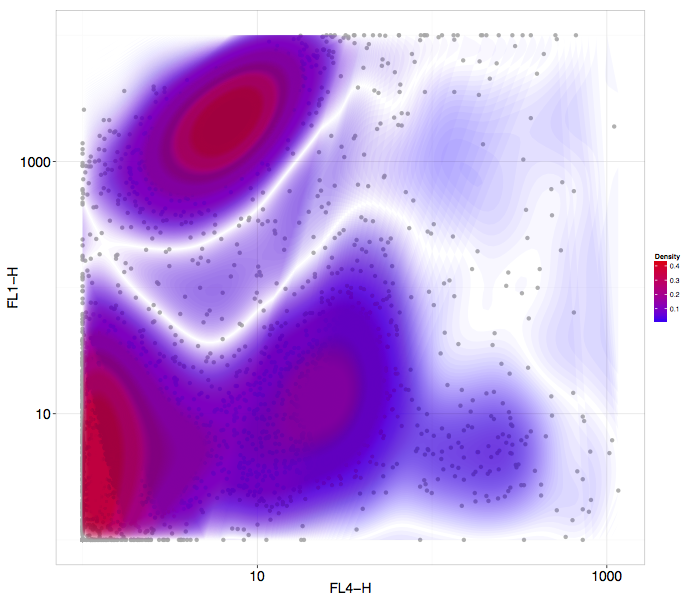
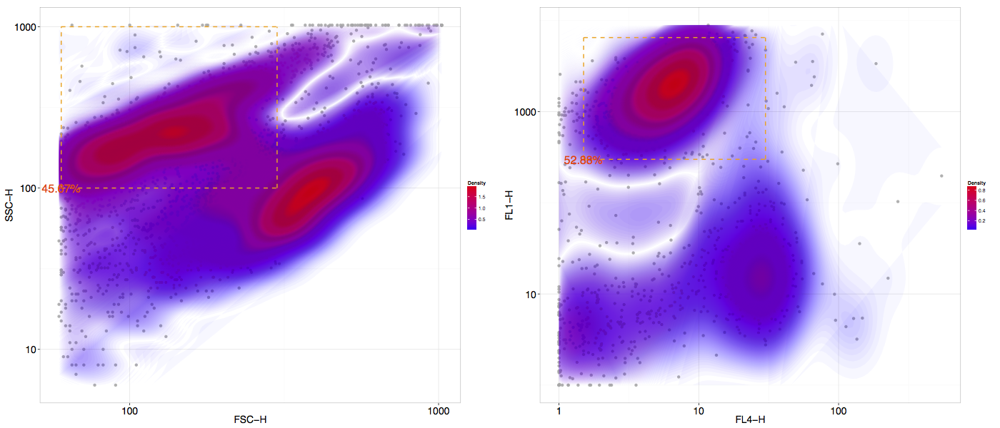

ggflow
========================================================

ggflow is a plotting package for flowcytometry built on ggplot2 and flowCore. ggflow allows to easily plot flowFrame objects from FCS files into beautiful 2D scatter plots.

To install please install the devtools package and type

```{r}
library(devtools)
install_github("nbafrank/ggflow")
```

this package requires the ggplot2 and flowCore packages.


```{r}
library(ggplot2)
library(flowCore)
library(ggflow)
```
To test it, you can use flowCore's example data by typing

```{r}
data(GvHD)
```

In this data, you can use ggflow to plot FL4-H against FL1-H in log10 scale with an onverlaying density contour plot by simply typing:

```{r,fig.height=12,fig.width=14}
ggflow_plot(GvHD[[1]],x_value="FL4-H",y_value="FL1-H")
```




You can also create and plot a rectangular gate which will be displayed on the plot and provide a % count of the selected cells/events.

```{r}
rectGate <- rectangleGate("FL1-H"=c(300, 6500),"FL4-H"=c(1.5,30))
```

```{r,fig.height=12,fig.width=14}
gg_rectgater_display(ggflow_plot(GvHD[[1]],x_value="FL4-H",y_value="FL1-H"),rectGate)
```


Additionally the rectangular gate object can also be used to select cells/events to be displayed. This is useful for instance if you are interested in gating a parameter and then plot others.

```{r}
rectGate_cut <- rectangleGate("FSC-H"=c(60, 300),"SSC-H"=c(100,1000))
```

```{r,fig.height=12,fig.width=14}
gg_rectgater_display(ggflow_plot(GvHD[[1]],x_value="FSC-H",y_value="SSC-H"),rectGate_cut)

gg_rectgater_display(gg_rectgater_cut(ggflow_plot(GvHD[[1]],x_value="FL4-H",y_value="FL1-H"),rectGate_cut),rectGate)
```




